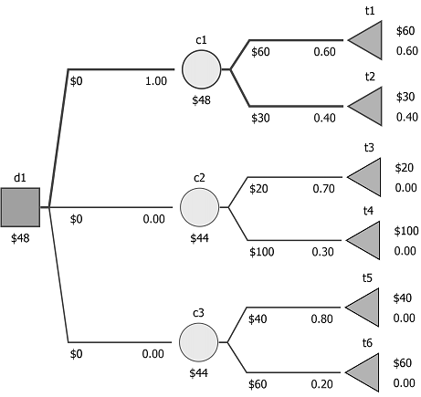

Chondro - decision tree sensitivity analysis library 
====================================================

Very quick start
----------------

    from chondro import *
    t = load_tree("examples/case1.json")
    print_tree(t)
    solve_tree(t)
    print_tree(t)
    print(find_stability(t))
    print(find_perturbation_pessopty(t))
    print(find_perturbation_mode(t))
    

Library overview [for full documentation see the docs folder]
-------------------------------------------------------------

*Chondro* – is an analytical engine that implements the decision tree
(DT) sensitivity analysis (SA) algorithms. All the methods support both 
for separable and non-separable
decision trees. Chondro has been developed with the Python3 and has been
tested with Anaconda 2.3.0 running Python3 version 3.4.4.

The software can load files stored by the (available at
<http://www.silverdecisions.pl>) or uses internal JSON format. A DT is
presented as a Python dictionary structure with each node described with
a `type` (choice,decision,final), `id`, `value` (pay-off), and a list
(`nodes`) containing child nodes. The probability values `p` (for
separable DTs) or identifiers `pi` (for non-separable DTs) are stored in
children nodes of a chance node. Chondro
supports non separable DTs through injection of probability values as a
dictionary. In order to perform stability and perturbation analysis for
non-separable decision trees a function that generates probability
dictionary on the base of fundamental probabilities should be provided
to a respective algorithm. 

It should be noted that Chondro heavily relies on the Python `fractions`
package for numerical computing and hence enables calculation and
comparison of the exact values for P-optimal decisions. In this way we
managed to avoid numerical problems when expected values at different
nodes are equal.

Below you can find a sample separable decision tree and a corresponding JSON representation. The
probability and payoff values are given as string rather than number
values in order to enable a proper conversion with the `fractions`
module. 

    {
      "tree": {
        "type":"decision", "id":"d1",
        "nodes": [
          { 
            "type":"chance","id":"c1",
            "nodes": [
              {"p":"0.6","type":"final","id":"t1","value": "60" },
              {"p":"0.4","type":"final","id":"t2","value": "30" }        
            ]             
          },
          { 
            "type":"chance","id":"c2",
            "nodes": [
              {"p":"0.7","type":"final","id":"t3","value": "20" },
              {"p":"0.3","type":"final","id":"t4","value": "100" }        
            ]             
          },
          { 
            "type":"chance","id":"c3",
            "nodes": [
              {"p":"0.8","type":"final","id":"t5","value": "40" },
              {"p":"0.2","type":"final","id":"t6","value": "60" }             
            ]
          }     
        ]
      }
    }

A sample non-separable decision tree and a part of the corresponding JSON
representation.

    {
        "tree": {
            "type": "decision", "id": "d1",
            "nodes": [
                {
                    "type": "final","label":"sell","id": "t1","value": "800"
                }, 
                {
                    "type": "chance","label":"dig","id": "c1","value": "-300",
                    "nodes": [
                        {
                            "pi": "gas", "label":"gas",
                            "type": "final", "id": "t2", "value": "2500"
                        }, 
                        {
                            "pi": "no_gas", "label":"no_gas",
                            "type": "final", "id": "t3", "value": "0"
                        }
                    ] 
                }, 
                {
                    "type": "chance","label":"test","id": "c2","value": "-50",
                    "nodes": [
                        {
                            "pi": "neg._test", "label":"negative",
                            "type": "decision", "id": "d2",
                            "nodes": [
                                {
                                    "type": "final", 
                                    "label":"sell",
                                    "id": "t4", 
                                    "value": "600"
                                }, 
    (... in order to increase readibility only part og tree has been shown ...)

Sensitivity analysis of separable trees
---------------------------------------

A typical example session with Chondro might consist of the following
steps:

1.  create a JSON representation of a DT (either by saving a DT from
    SilverDecisions or manually creating a JSON file)

2.  Use the function to load a DT to memory

3.  Use the function to calculate optimal decision for the DT. The
    function supports non-separable trees by accepting a
    probability dictionary.

4.  perform the sensitivity analysis

The Listing below presents a sample code to solve the decision
tree. We first start by loading the module. Next a
JSON file is loaded with the function. It should be noted that this
function supports JSON files in both internal dictionary format as well
as files that can be exported from SilverDecisions software (available
at <http://www.silverdecisions.pl>). The function `solve`
returns a tuple where the first element is the expected value of DT and
the second dictionary of optimal decisions.

    from chondro import *

    file_name = "example_separable_Fig5.json"
    tree = load_tree(file_name)
    ev,dec=solve_tree(tree)
    print ("DT has been solved, the expected value is ev: "+str(ev)+ \
           " reachable decisions: "+str(get_reachable(dec)))

    print_tree(tree)

    stabi = find_stability(tree,precision=Fraction("1/10000") )
    print ("DT stability", stabi)

    ress = find_perturbation_mode(tree,precision=Fraction("1/1000"))
    print("DT perturbation mode",ress)

    ress = find_perturbation_pessopty(tree,precision=Fraction("1/1000"))
    for key in ress.keys():
        print ("P_"+key, ress[key])     

Sample output

    d1:decision
      *c1:chance (ev=48)
        t1:p=3/5 final [60]
        t2:p=2/5 final [30]
       c2:chance (ev=44)
        t3:p=7/10 final [20]
        t4:p=3/10 final [100]
       c3:chance (ev=44)
        t5:p=4/5 final [40]
        t6:p=1/5 final [60]

Sensitivity analysis of non-separable trees
-------------------------------------------

The Chondro library is capable of processing both separable and non
separable trees. Due to much larger computational complexity of
non-separable the library has different internal implementation of
stability and perturbation algorithms for both tree types. A sample
non-separable decision tree has been presented in the first paragraph of this page.

The support for non-separable trees is achieved by providing to the
function an additional parameter `derived_probs_dict` that contains a
dictionary of key-probability values that can be injected into `pi`
fields in a decision tree. Hence, there are two differences in
processing non-separable DTs compared to separable ones:

-   probabilities in the decision tree are represented as keys rather
    than values and use `pi` fields instead of `p` fields.

-   in order to perform sensitivity analysis a function needs to be
    provided that transforms fundamental probabilities into dictionary
    of key-value pairs that can be injected by Chondro into `pi` fields
    in a DT

Calculating stability and perturbation requires performing a sweep over
a set of fundamental probabilities and providing a function transferring
those probabilities into a key-probability dictionary. Hence, the
methods , and require providing two additional parameters:

-   *derived_probs_lambda* - a function that calculates derived
    probabilities on the base of fundamental ones. The function should
    return a dictionary where keys are corresponding to `pi` values in a
    decision tree.

-   *fundamental_probs* - a list of initial vales of fundamental
    probabilities

An example function that calculates probabilities on the base of
fundamental ones has been presented below

The initial values for fundamental probabilities is represented as a
list of events where each event is described by a list of outcome
probabilities. Moreover, if there are $n$ possible outcomes of an event
the probabilities of n-1 should be only passed - the last n-th
probability will be automatically calculated. For example suppose that
we consider two fundamental probabilities result of throwing a coin and
a result of throwing a four-sided dice. In that case the fundamental
probabilities in Chondro will be presented as:
`[[0.5],[0.25,0.25,0.25]]`.

In Listing below an example processing of a non-separable
decision tree has been presented. Firstly, fundamental probabilities
values need to be defined. Those values
can be used to calculate a P-optimal decision. Next, we defined `s` values
representing whether a particular event (for which fundamental
probabilities have been given) should be a subject of sensitivity
analysis. Finally, we perform the stability analysis - in our
computations we limit the maximum considered value of `epsilon` to
`1`.

    def tree_derived_probs_lambda(probs): 
        p=dict()
        p["gas"] = probs[0][0]
        sensitivity = probs[1][0]
        specifity = probs[2][0]
        p["no_gas"] = 1-p["gas"]
        p["pos._test"]=sensitivity*p["gas"]+  \
        (1-specifity)*p["no_gas"]
        p["neg._test"]=1-p["pos._test"]
        p["gas|pos._test"]=sensitivity*p["gas"]/p["pos._test"]
        p["no_gas|pos._test"]=1-p["gas|pos._test"]
        p["gas|neg._test"]=(1-sensitivity)*p["gas"]/  \
        p["neg._test"]
        p["no_gas|neg._test"]=1-p["gas|neg._test"]
        return p
        

    from chondro import *

    tree = load_tree("exaple_non_separable_fig7.json")
    fund_probs = [[Fraction("7/10")],[Fraction("9/10")],[Fraction("7/10")]]
    solve_tree(tree,tree_derived_probs_lambda(fund_probs))
    print_tree(tree)
    s = [1,0.1,0.1]
    stabi = find_stability(tree,tree_derived_probs_lambda, \
              fund_probs,precision=Fraction("1/100"),s=s,max_epsilon=1) )
    print ("stability", stabi)
    ress = find_perturbation_mode(tree,tree_derived_probs_lambda,\
             fund_probs,precision=Fraction("1/100"),s=s,max_epsilon=1))
    print("mode perturbation",ress)
    ress = find_perturbation_pessopty(tree,tree_derived_probs_lambda,\
             fund_probs,precision=Fraction("1/100"),s=s,max_epsilon=1) )
    for key in ress.keys():
        print ("P "+key, ress[key])
